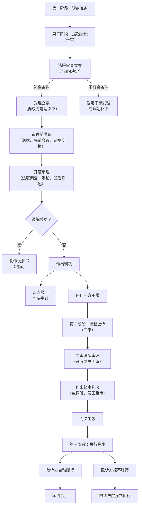

### 这种民事纠纷案件的诉讼流程？

好的，校园人身损害赔偿案件作为典型的民事纠纷，其诉讼流程遵循《中华人民共和国民事诉讼法》的规定。以下是详细的步骤，您可以将它视为一份“ roadmap”来了解整个法律进程。

### 民事诉讼流程图（简化版）

---

### 第一阶段：诉前准备（非常关键）

这是提起诉讼之前最重要的工作，直接关系到诉讼的成败。

1.  **证据收集与固定**：
    *   **医疗证据**：全部病历、诊断证明、医疗费发票、后续康复费用的预估证明等。
    *   **现场证据**：向学校申请调取并复制**监控录像**（这是核心证据）；现场照片；损坏的衣物、物品等。
    *   **证人证言**：联系其他在场孩子的家长，争取获取证人证言并保留联系方式。
    *   **沟通记录**：与对方家长、学校老师、领导沟通的微信、短信、邮件记录或通话录音。
    *   **其他证据**：学校的《事件处理情况说明》、报警回执（如果报过警）等。

2.  **损失计算**：
    *   根据《民法典》和司法解释，详细列出索赔清单，包括：
        *   **医疗费**：已发生的和后续治疗所需的。
        *   **护理费**：根据护理人员的收入或当地护工标准计算。
        *   **交通费**：往返医院的票据。
        *   **营养费**：根据医嘱和伤残情况确定。
        *   **残疾赔偿金**：如果经鉴定构成伤残，根据伤残等级和当地标准计算。
        *   **精神损害抚慰金**：如果造成严重精神痛苦或伤残，可以主张。
        *   **其他**：鉴定费、诉讼费等。

3.  **（可选）司法鉴定**：
    *   如果伤情可能构成伤残，可以在诉前委托律师事务所向有资质的司法鉴定机构申请**伤残等级鉴定**和**护理期、营养期鉴定**。鉴定结论是索赔残疾赔偿金的关键依据。

4.  **撰写起诉状**：
    *   明确**原告**（受害孩子及监护人）、**被告**（侵权孩子、其监护人、学校）。
    *   写清**诉讼请求**（即要求法院判什么，如：判令被告支付各项损失共计10万元）。
    *   陈述清晰的**事实与理由**（事情经过、对方过错、法律依据）。

5.  **确定管辖法院**：
    *   通常由**被告住所地**（侵权方家长户籍地或经常居住地）或**侵权行为地**（学校所在地）的人民法院管辖。选择时可以考虑哪个法院更方便或更可能有利于自己。

---

### 第二阶段：提起诉讼与一审程序

1.  **立案**：
    *   向有管辖权的法院立案庭提交**起诉状**、**证据清单及复印件**、**身份证明**（孩子户口本、父母身份证复印件）。
    *   法院审查后，7日内决定是否立案。立案后，会预收案件受理费。

2.  **送达与答辩**：
    *   法院向被告送达起诉状副本。被告（侵权方家长和学校）应在**15日内**提交**答辩状**，并出示对自己有利的证据。

3.  **庭前会议/证据交换**：
    *   法官可能组织双方交换证据副本，明确争议焦点，并尝试进行**调解**。这是一个非常重要的解决纠纷的机会。

4.  **开庭审理**：
    *   **法庭调查**：原告陈述诉求 → 被告答辩 → 原告举证、被告质证 → 被告举证、原告质证 → 法官询问。
    *   **法庭辩论**：双方围绕争议焦点（如责任比例、赔偿金额）发表辩论意见。
    *   **最后陈述**：双方总结各自观点。
    *   **法庭调解**：庭审结束后，法官会再次询问双方是否愿意调解。

5.  **宣判**：
    *   如果调解失败，法院将择日作出判决。当事人当庭领取判决书或等待法院邮寄送达。

---

### 第三阶段：二审与执行程序

1.  **上诉（二审）**：
    *   任何一方对一审判决不服，可在收到判决书之日起**15日内**向上一级人民法院提起上诉。
    *   二审法院可能开庭审理，也可能书面审理。二审判决是**终审判决**，一经作出即生效。

2.  **执行**：
    *   **判决生效后**，负有履行义务的一方（通常是败诉方）应按时支付赔偿款。
    *   如果对方拒不履行，胜诉方可以在**判决生效后2年内**向一审法院申请**强制执行**。法院可以采取查封、冻结、扣押、列入失信名单、限制高消费等措施。

### 给您的建议

*   **调解优先**：诉讼耗时较长（一审普通程序约6个月），且过程可能对孩子们造成二次心理影响。在诉前、诉中任何阶段，都应积极考虑在法院主持下达成调解，这往往是更快、更缓和矛盾的解决方式。
*   **专业支持**：鉴于流程复杂且证据规则专业，强烈建议咨询甚至委托律师处理，尤其是在损失金额较大、责任争议激烈的情况下。
